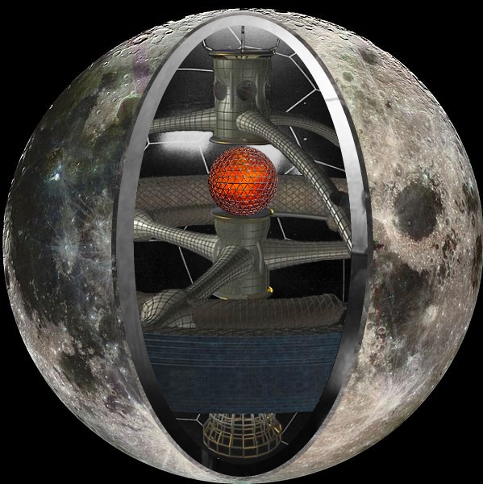
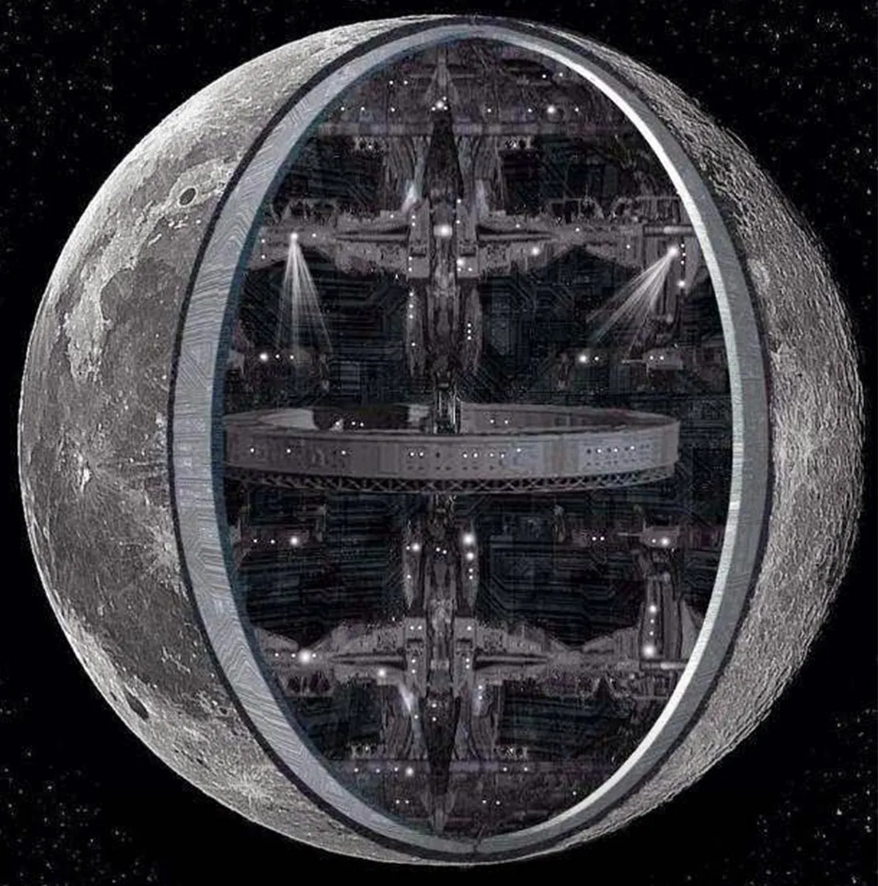

+++
date = '2026-04-26T20:32:50+02:00'
title = 'The Hollow Moon and the Primordials'
description = "Learn about the Hollow Moon theory and the alien species which created it: the Primordials"
canonical = "https://paranoi-i.github.io/egoless/hollow-moon-primordials/"
+++
```
Prior Knowledge Required:
- Ancient Aliens Theory
- Hollow Moon Theory
```


The seismometer's results from the Apollo missions were the first thing that made me question the nature of our Moon.


If it is indeed hollow, like many of us believers in the UFO phenomenon and in the Ancient Alien Theory think, then it is also artificial.


But I do not claim that it is in fact a spaceship. I never did.


I believe it is an artificial satellite, made to favour the development of life on Earth.





source: https://en.wikipedia.org/wiki/Hollow_Moon





source: https://medium.com/a-history-of-the-multiverse/chapter-2-part-1-the-earth-gets-a-moon-a-really-really-weird-moon-3395c48ac9e0


In the book "What if the Moon Didn't Exist?: Voyages to Earths That Might Have Been", Neil F. Comins, Professor of Physics and Astronomy at the University of Maine, explained how the Earth would have been without the Moon.


His conclusion was that, without the Moon, life on Earth would have developed several HUNDREDS OF MILLIONS of years later than it did. And that is IF it would have developed AT ALL.


For those of us who believe on the Ancient Aliens theory, it is obvious that the aliens created our Moon to favour the creation of mankind.


But think for a second.


The Earth and the Moon are, according to current estimates, 4.6 billions years old.


How is it possible that the same aliens described by the Sumerians and other ancient civilisations, already existed almost 5 billions years ago. And that they already had the technology to create an artificial satellite as massive as the Moon.


In my opinion, that is impossible.


My theory is that a different alien species existed at the beginning of the universe. I call them the Precursors, but that is just placeholder as we can't possibly know what they were called.


This species, now most likely extinct, was the first to exist in the universe and used their extremely advanced technology to create the conditions for life to develop on other parts of the universe.


Us, as well as the Ancient Aliens, are a product of their efforts.


Artificial satellites to make the conditions of habitable planets more stable, directed panspermia and most likely many other techniques were used to spread life across the universe.


The Ancient Aliens then continued the Primordials' mission.


They started the evolution of mankind, from primates to human beings.


However, that wouldn't have been possible without the efforts of the Primordials.
